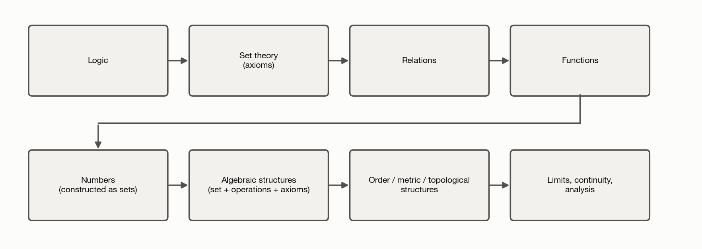

"Map of mathematics" videos are a genuinely useful genre — and they share a
flaw. They draw one tree, with arithmetic at the root and category theory
somewhere near the leaves, and that tree quietly answers three different
questions at once: *when* was this idea discovered, *what* does it formally
rest on, and *what* should you learn first. Those are three different
graphs. They mostly agree, which is exactly what makes it easy to stop
noticing when they don't — and the times they don't are usually the most
interesting fact about the idea in question.

This chapter is the map: four orderings that get conflated if you're not
careful, and the master diagram — built from the second half of that
list, the ones that actually organize this site — that the rest of the
book hangs off of.

## Four maps, not one

**Historical development** — when an idea actually first appeared, in
whatever form. Approximate, contested in places, and simplified below; treat
every date as "roughly."

.](../images/historical-timeline.png){#fig-historical-timeline}

The gap between C and D is the one worth sitting with: calculus is roughly
two centuries *older* than the rigorous theory of limits it's now formally
built on, and about the same distance older than the set theory that
formally underlies *that*. Newton and Leibniz got correct answers using
infinitesimals nobody could yet justify.

**Formal/logical foundations** — how mathematics is built up today, if you
start from axiomatic set theory and add machinery one layer at a time.

{#fig-formal-foundations}

**Conceptual dependency** — what you need to *understand*, not formally
construct, before an idea makes sense. Much sparser than the formal graph:
grasping a group needs "a set with a binary operation," full stop — not a
Zermelo–Fraenkel construction of the natural numbers underneath it.

**Pedagogical ordering** — the sequence that actually motivates learning
best, which deliberately violates the formal graph when doing so helps: this
site shows $\mathbb{R}^n$ before the abstract vector-space axioms even
though, formally, $\mathbb{R}^n$ presupposes more machinery than the axioms
alone do.

A few concepts, placed on all four at once, make the gaps concrete:

| Concept | Historical origin | Formal foundation | Conceptual prerequisite | Where this site teaches it |
|---|---|---|---|---|
| Sets | Cantor, 1870s–80s | Axioms of ZFC | Almost none — "a collection of things" | [Sets](03-sets.qmd) |
| Groups | Implicit in Galois's work on equations, 1830s; axioms formalized by Cayley (1854)/Weber (1893) | A set with one operation satisfying four axioms | Set + binary operation | [Groups](08-groups.qmd) |
| Vector spaces | Peano's axioms, 1888 — after $\mathbb{R}^n$, matrices, and polynomials were all already in wide use | A set over a field with two operations satisfying eight axioms | Group (for addition) + a notion of scaling | [Vector Spaces](09-vector-spaces.qmd) |
| Limits / calculus | Newton & Leibniz, 1660s–80s, informally | Built from the topology of $\mathbb{R}$ | Function + a notion of "arbitrarily close" | [Limits and Continuity](17-limits-and-continuity.qmd) |

Notice the direction of the gap is not always the same: sets are historically
recent but conceptually nearly free; calculus is historically ancient (by
mathematical standards) but formally late, resting on machinery invented to
justify it after the fact. Whenever this site says "this came before that,"
the table above is the implicit question: before in *which* sense?

## The master map

The diagram below is this site's actual spine — the chapters that exist
today, plus a few later ones drawn hollow so the shape of the whole graph is
visible even where the content isn't written yet. Two dozen-plus edges is
too many to individually label on a diagram this size without recreating
the exact clutter this figure is replacing, so read edge *direction* as
pointing toward the more-built-up idea — every edge in the current graph
is a forward relationship. Where an arrow crosses between colors it is
doing one of three things: carrying a *conceptual prerequisite* (third row
of the table above — e.g. Number Systems into [What Is a
Structure?](07-mathematical-structures.qmd)), an *abstraction* relationship
in the sense of that same chapter (What Is a Structure? into Groups, Rings
and Fields, and Vector Spaces; Vector Spaces into Inner Product Spaces and
Affine Spaces), or an *application* pulling an idea in from outside pure
mathematics (Linear Algebra and Differential Equations into Machine
Learning and Physics). This is a map, not a dependency proof — some
edges could legitimately be drawn elsewhere, and that's a feature of a
graph, not a bug to fix by turning it into a tree.

![This site's chapter graph, positioned by a computed longest-path layering (topological sort, not a force simulation or hand-placed boxes — see `scripts/figures/fig_landscape_network.py`) rather than the Mermaid version this replaced, whose dark subgraph fill and edge routing broke against this site's light theme. Solid, filled, white-labeled nodes are chapters that exist; hollow, dashed-outline nodes (Machine Learning, Physics) are planned — dashed *edges* mark a connection into one of those planned nodes, not a different kind of relationship. Every edge is a forward conceptual-prerequisite, abstraction, or application relationship, per the paragraph above.](../images/landscape-network.png){#fig-landscape-network}

## Two ways in

**Top-down, from bedrock** — the order in the table of contents:
[Logic](02-logic-and-proof.qmd) → [Sets](03-sets.qmd) →
[Relations & Functions](04-relations-and-functions.qmd) →
[Axioms & Definitions](05-axioms-and-definitions.qmd) →
[Number Systems](06-number-systems.qmd) →
[What Is a Structure?](07-mathematical-structures.qmd) →
[Groups](08-groups.qmd) / [Vector Spaces](09-vector-spaces.qmd) →
[Linear Algebra](10-linear-algebra.qmd).

**Bottom-up, from something you already use** — the mirror image. An ML
practitioner who writes `embedding_matrix @ x` and wants to know what world
that equation actually lives in reads
[Machine Learning](24-machine-learning.qmd) →
[Linear Algebra](10-linear-algebra.qmd) →
[Vector Spaces](09-vector-spaces.qmd) →
[What Is a Structure?](07-mathematical-structures.qmd) and stops once the
ground feels solid — not necessarily all the way back to Logic. Neither
direction is more correct; they're the same graph traversed in opposite
order, which is the whole point of building this as a graph rather than a
syllabus.

## Five threads that keep coming back

A handful of ideas recur across nearly every chapter under different names.
Naming them once here means later chapters can just point back:

- **Generalization** — $\mathbb{N} \to \mathbb{Z} \to \mathbb{Q} \to
  \mathbb{R} \to \mathbb{C}$; $\mathbb{R}^n \to$ vector space $\to$
  inner-product space $\to$ metric space. Every step gains something and
  loses something, and naming both sides of that trade is more useful than
  just naming the gain.
- **Structure over identity** — mathematicians increasingly care less about
  what an object "is" and more about what operations it supports. A
  polynomial, a matrix, and a function can all be vectors; see
  [What Is a Mathematical Structure?](07-mathematical-structures.qmd)
- **Invariance** — what stays true under a transformation. This is the
  thread connecting symmetry, [group theory](08-groups.qmd), [linear
  algebra](10-linear-algebra.qmd), [geometry](16-euclidean-geometry.qmd),
  and (later) physics.
- **Transformation** — [functions](04-relations-and-functions.qmd), then
  [linear maps](10-linear-algebra.qmd), then [differentiable
  maps](18-differentiation.qmd), then [continuous
  maps](17-limits-and-continuity.qmd): successively looser notions of
  "structure preserving."
- **Local vs. global** — a [derivative](18-differentiation.qmd) is a local
  fact about a function; a [basis](09-vector-spaces.qmd) is a global fact
  about a vector space. The distinction resurfaces in every branch this
  site eventually reaches.

[What Is Mathematics?](01-what-is-mathematics.qmd), next, picks up the
thread from here with the question underneath all of this: what is
mathematics, actually, if not a pile of courses?
